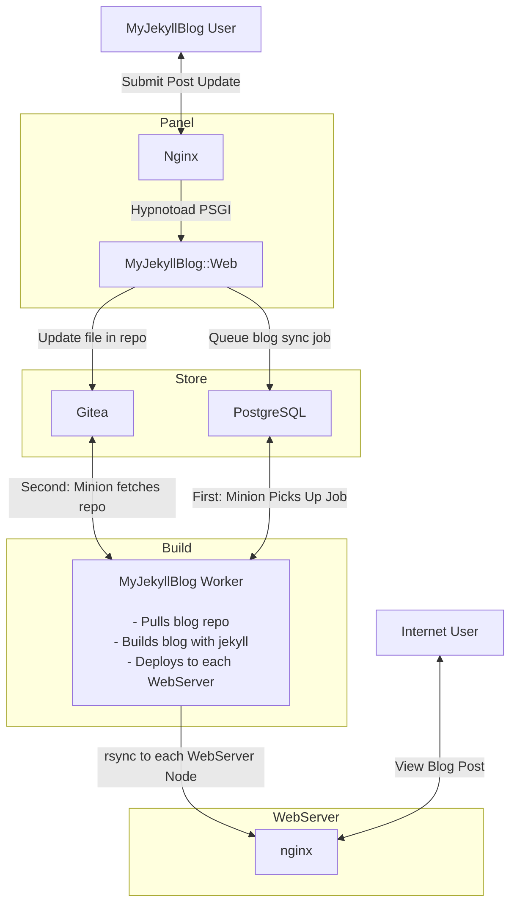

# MyJekyllBlog

This is MyJekyllBlog: it’s a multi-user CMS and hosting platform for Jekyll blogs.

Multi-user means many different people can create accounts and make their own blogs.  User registration can be open, invite-only, or require payment with stripe.  The CMS feature means that those same people can create posts, pages, upload media for their blogs or edit and delete those same kinds of things. With the included hosting platform, these blogs can be be displayed directly to people on the Internet.

MyJekyllBlog comes with a complete set of ansible roles to automate the installation.


## Screenshots


The post listing page, where you can add, edit, or delete blog posts.


The post creator, where you can add a new blog post.


The jobs interface, where you can see the progress of your site's deployment and other tasks.


The admin interface's server panel.  Where servers the blogs are deployed to can add added and removed.

## Table of Contents

1. [MyJekyllBlog](#myjekyllblog)
    1. [Table Of Contents](#table-of-contents)
    2. [Meet The Servers](#meet-the-servers)
        1. [Panel](#panel)
        2. [Build](#build)
        3. [Store](#store)
        4. [Certbot](#certbot)
        5. [WebServer](#webserver)
    3. [Overview](#overview)
2. [Installation Guide](#installation-guide)
    1. [Designing The Network](#designing-the-network)
    2. [Running The Installation With Ansible](#running-the-installation-with-ansible)
    3. [Configure The Panel](#configure-the-panel)
    4. [Configure The Store](#configure-the-store)
3. [Operations Guide](#operations-guide)
    1. [How to perform a system backup](#how-to-perform-a-system-backup)
        1. [Backup Gitea Data](#backup-gitea-data)
        2. [Backup PSQL Data](#backup-psql-data)
    2. [How to perform a system restore](#how-to-perform-a-system-restore)
        1. [Restore Gitea Data](#restore-gitea-data)
        2. [Restore PSQL Data](#restore-psql-data)
4. [Development Guide](#development-guide)
    1. [Enable development mode](#enable-development-mode)
    2. [Reload Default Minion Worker](#reload-default-minion-worker)
    3. [Reload Certbot Minion Worker](#reload-certbot-minion-worker)
    4. [Extend the DB Schema](#extend-the-db-schema)
    5. [Run Jekyll](#run-jekyll)
5. [Roadmap](#roadmap)

## Meet The Servers

This table shows a brief overview of the server types and their relationships.  Additional descriptions for each server type follows the table.

| Server    | Description                          | Services          | Talks To              |
| --------- | ------------------------------------ | ----------------- | --------------------- |
| Panel     | Runs customer-facing web interface   | mjb.panel, nginx  | build, store          |
| Build     | Runs site builders, deploys blogs    | mjb.worker        | store, webservers     |
| Store     | Source of truth - Database, Gitea    | postgresql, gitea | panel, build, certbot |
| Certbot   | Handles getting/updating SSL certs   | mjb.certbot       | store, webservers     |
| WebServer | Hosts customer blogs on the internet | nginx             | certbot, build        |

### Panel

The Panel server hosts the web application that customers can use to provision blogs, publish articles, upload media and otherwise manage their blogs.  Administrators can use it to check users/blogs on the system, run maintenance tasks, and configure some aspects of the system.

### Build

The build server processes Jekyll git repositories into static websites and deploys the fully built website to the webservers for hosting.

### Store

The store server hosts two database with postgresql.  One database supports `MyJekyllBlog::DB` and another supports Minion.  The Panel, Build, and Certbot servers all need access to these databases.

The store server also hosts an installation of Gitea so that each Jekyll blog may have its own central git repository.  The panel server will checkout and commit/push to this server.  The build server will checkout the repository from this server for building.

### Certbot

The CertBot server handles obtaining SSL certificates from Let's Encrypt and pushing them to the webservers.

When HTTP challenges are used, `/.well-known/` is proxied from ALL webserver nodes to the certbot node and `--standalone` is used from the certbot node to obtain an SSL certificate.

When DNS challenges are used, wildcard certificates may be obtained (and is recommended for hosts expecting many sub-domains to be made).

The `/etc/letsencrypt` directory is synced with webserver nodes through rsync whenever new certificates are obtained.  An administrator can update and sync SSL certificates from the admin panel.

### WebServer

WebServers run nginx and host static content for Jekyll blogs.  When a blog is provisioned, an SSL certificate will be requested for the site and an nginx configuration file will be created.

The build servers will sync the blog content with webservers each time the blog is updated through the Panel.

## Overview

This diagram shows a view of a user updating a post and somebody from the Internet viewing a post.



## Installation Guide

This guide will follow my process of installing the software to run on `mds-stage.com` and serve blogs on `mds-stage-blog.com`.  If you follow along, you could have your own version up and running in a couple of hours.

### Designing The Network

I need at least one of each server type.  I will, however, use two WebServers and have one on the west coast and another on the east coast.  I will need six servers, and I will name them `panel`, `store`, `build`, `certbot`, `web-west`, `west-east`.

I want the database server running on `store` not to be exposed to the Internet at large, and I will use the private networking feature of my VPS provider to get private IPs for `panel`, `store`, `build`, and `certbot`.  This means I also need to have all of those machines running in the same datacenter.

Each machine should be running Debian 11.

| Machine  | Public IP       | Private IP      | Domain                    |
| -------- | --------------- | --------------- | ------------------------- |
| panel    | 45.79.31.186    | 192.168.213.90  | panel.mjb-stage.com    |
| build    | 45.33.25.211    | 192.168.188.226 | build.mjb-stage.com    |
| store    | 69.164.204.212  | 192.168.216.75  | store.mjb-stage.com    |
| certbot  | 96.126.122.198  | 192.168.163.105 | certbot.mjb-stage.com  |
| web-west | 173.255.249.43  | N/A             | web-west.mjb-stage.com |
| web-east | 173.255.225.48  | N/A             | web-east.mjb-stage.com |

Once I have these machines provisioned I lay out the information about them in the table above.  I will need this information to begin writing the configuration file.

For each of these machines, I update DNS records so that the domain maps to the public IP address for each machine.

Additionally, I add two DNS records for `*.mds-stage-blog.com`, one A record with `173.255.249.43` and another A record with `173.255.225.48`.  This maps all sub-domains of `mds-stage-blog.com` to the web servers so that they may serve the blogs to people on the Internet.  People on the Internet will go to one or the other server.

Before proceeding from this section, review the section checklist to ensure you have completed all item.

|  X  | Section Checklist Items                             |
| --- | --------------------------------------------------- |
| [ ] | Provision machine for panel, build, store, certbot  |
| [ ] | Provision one or more machines for webservers       |
| [ ] | Create table with your machine information          |
| [ ] | Add DNS records for each machine                    |
| [ ] | Add wildcard DNS record for each WebServer          |

### Running The Installation With Ansible

The installation process has been codified into a number of ansible roles that are included in this repository.  I will need ansible installed so that I have access to the `ansible-playbook` command, and I will need to have SSH credentials to each of these machines so that ansible may install and configure the network.

From the root directory of a clone of this repository, I do the following.

```bash
cd ansible/
mkdir -p env/stage

# Copy and edit the inventory file for your network.
cp env/example/inventory.yml env/stage/inventory.yml
vim env/stage/inventory.yml

# Copy and edit the secrets for your network
cp env/example/vault.yml env/stage/vault.yml
vim env/stage/vault.yml

# Create a vault password to encrypt your secrets with
perl -e'print join("", map { ('A'..'Z','a'..'z',0..9)[int rand 62] } ( 0 .. 128 )), "\n"' > .vault_password

# Encrypt your secrets with the vault password
ansible-vault encrypt --vault-password-file .vault_password env/stage/vault.yml
```

I named the configuration file `env/stage/inventory.yml`, since this will be a staging environment.  I placed this in its own directory because some environment specific files will be stored in the inventory directory, and keeping seperate directories will prevent file clobbering.  One should pay special attention to go through this example config file and update it with details of their network.  I updated the vault file with new passwords and then encrypted it.  Once this is complete, the installation should be smooth sailing with ansible.  I use the following command to get everything installed.

```bash
ansible-playbook -i env/stage/inventory.yml --vault-password-file .vault_password -e @env/stage/vault.yml site.yml
```

This command took about two and a half hours to complete, it should largely setup the whole platform across all of the machines.

Before proceeding from this section, review the section checklist to ensure you have completed all item.

|  X  | Section Checklist Items                                   |
| --- | --------------------------------------------------------- |
| [ ] | Checked repo out to a machine with ansible and ssh access |
| [ ] | Network specific ansible inventory file was created       |
| [ ] | Ansible runs through the entire playbook with no errors   |

### Configure The Panel

An initial admin account is created during the ansible installation.  The credentials for the admin account are in the `inventory.yml` file under `admin_user:`.

Now that I have the admin account credentials, I can access the Servers tab at https://panel.mjb-stage.com/admin/servers

The tab configures web servers that the system will deploy blogs to.  Each of the webservers that were configures by Ansible should go here, so I enter `web-west.mjb-stage.com` and then `web-west.mjb-stage.com`.  The servers tab now lists these two servers.

Next I need to go to the Domains tab and add `mjb-stage-blog.com`.

There is a drop down for SSL Challenge.  When selecting `HTTP`, each time a blog is added, certbot will be used to complete an HTTP challenge for the domain.  When selecting `DNS-Linode`, a Wildcard SSL certificate will be obtained and then blogs will not need their own certificates.  `DNS-Linode` requires a Linode account and API credentials.

|  X  | Section Checklist Items                                   |
| --- | --------------------------------------------------------- |
| [ ] | Created admin account, can login and view Admin Panel     |
| [ ] | Added Web Servers to Admin Panel -> Servers               |
| [ ] | Added Hosted Domains to Admin Panel -> Domains            |

### Configure The Store

During the installation process, an SSH keypair was created.  The public key must be added to the Gitea user that was setup.  This must be done through the Gitea web panel.

1. Login to Gitea on the store server, using the credentials for gitea user/pass from the inventory file.
2. Click the user drop down in the upper right
3. Click Settings from the drop down menu
4. Click "SSH / GPG Keys"
5. Click "Add Key" under "Manage SSH Keys"
6. Type a title
7. Paste the contents of env/staging/files/ssh/id\_rsa.pub
8. Click to add the key

Once this is done, you'll need to create the mjb organization.

1. Click the + Plus button drop down
2. Click "New Organization"
3. Name the organization "mjb"
4. Click "Create Organization"

Now we need to add a Jekyll blog as a template.

Get a shell into the build server and create a new Jekyll blog.

```bash
# Create the default blog
alias jekyll="podman run -ti --rm -v .:/srv/jekyll -e JEKYLL_ROOTLESS=1 docker.io/jekyll/jekyll jekyll"
jekyll new jekyll-default

# Push this default to the panel_config.jekyll_init_repo repository
cd jekyll-default
git init
git remote add origin git@store.mjb-stage.com:manager/jekyll-default.git
git add * .gitignore
git commit -m "Initial Commit"
git push origin master
```

Now that the `panel_config.jekyll_init_repo` repository exists, we should be ready to rock and roll; give provisioning a blog a go.

|  X  | Section Checklist Items                                     |
| --- | ----------------------------------------------------------- |
| [ ] | Confirmed login to the Gitea install on store server        |
| [ ] | Added SSH key to the gitea user account                     |
| [ ] | Added mjb organization for blog repos to be added under     |
| [ ] | Pushed the jekyll repo to the jekyll\_init\_repo address    |

### Step 3: Confirm It All Works!

1. Create a user account
2. Create a blog
3. Create a post
4. Delete a post

## Operations Guide

### How to perform a system backup

There are two sources of truth for MyJekyllBlog that should be backed up regularly.

The first is the installation of Gitea, a Git Service, that MyJekyllBlog uses for storage and atomic changes of all Jekyll blogs it hosts.

The second is the PSQL database for mjb.panel.  This database contains all of the information about user accounts, blog ownership, etc.

#### Backup Gitea Data

Take a root shell on the store machine and stop gitea.

```bash
systemctl stop gitea
```

Confirm that gitea is stopped by going to the store server over HTTPS.  You should recieve a 502 Bad Gateway error.

```bash
su - git
cd /var/lib/gitea/
./gitea dump --c /etc/gitea/app.ini
```

There will be a file with a timestamp, such as `gitea-dump-1669000424.zip`.  This is the backup of all Gitea data and can be used to restore the repositories.

Remember to start Gitea again.

```bash
systemctl start gitea
```

#### Backup PSQL Data

Take a shell for the manager user on the store server and run the following.

```bash
cd mjb/Web
./script/mjb db_dump > psql-backup-`date +%s`.sql
```

### How to perform a system restore

#### Restore Gitea Data

See https://docs.gitea.io/en-us/backup-and-restore/#restore-command-restore for information on processing the gitea-dump-timestamp.zip file.

#### Restore PSQL Data

Instructions -- I should make an ansible task that handles this.

Drop database, create database, import SQL dump.

## Development Guide

### Enable development mode 

To make development easier, you can enable development tools on any given environment with ansible.  If I wanted to enable them on the stage environment, I would run the following command.

```bash
ansible-playbook -i env/stage/inventory.yml --vault-password-file .vault_password -e @env/stage/vault.yml tools-development.yml
```

Some changes to the environment after running the tools-development playbook are:

**Panel Server**

* Changes to files in `Web/lib` and `Web/template` will cause Mojolicious to reload the app
* Docker is installed to use `create-classes` in `DB/`

### Reload Default Minion Worker

The default minion worker handles building Jekyll blogs, syncing files and media, and other tasks that use the `default` queue.

To pull the latest changes and reload it, perform the following, replacing `build-server` with the hostname of the build server.

```bash
ssh manager@build-server 'cd mjb; git pull --ff-only origin master'
ssh root@build-server 'systemctl restart mjb.worker'
```

### Reload Certbot Minion Worker

The certbot minion worker handles let's encrypt certificate requests, syncing SSL certificates with web server nodes, and other tasks that use the `certbot` queue.

To pull the latest changes and reload it, perform the following, replacing `certbot-server` with the hostname of the certbot server.

```bash
ssh manager@certbot-server 'cd mjb; git pull --ff-only origin master'
ssh root@certbot-server 'systemctl restart mjb.certbot'
```

### Extend the DB Schema

To extend the DB schema you should be on a **panel** server after [Enabling development mode](#enable-development-mode).

The database can be extended by editing `DB/etc/schema.sql`

The DBIx::Class models can be regenerated with the updated `DB/etc/schema.sql` by running the following.

```bash
cd mjb/DB
./bin/create-classes
```

Inspect the newly generated DB/lib files.  To update an existing database, you may need to form alter table statements to match the changes you made to the schema.sql file.

### Run Jekyll

If you need to use Jekyll directly, shell into a build server and set the following alias.

```bash
alias jekyll="podman run -ti --rm -v .:/srv/jekyll -e JEKYLL_ROOTLESS=1 docker.io/jekyll/jekyll jekyll"
```

Once you have done so, you should be able to use `jekyll` directly.

## Roadmap

### Themes

Currently the default minima theme is installed and there is no obvious way to change the theme.  There should be a theme tab that allows selecting themes.

### Email Subscription / Notification

There is no way for users to subscribe and get email notifications when a new post is made.  Create an opt-in email system, and a form that MyJekyllBlog users can add to their blog to allow people on the Internet to subscribe for updates.

### Better Front-Matter UI

The UI only supports handling the title and date as UI items, otherwise a user is required to write YAML content.  Investigate Jekyll front matter options more and integrate them into the UI (and add a simple editor for page creation that doesn't require YAML)
